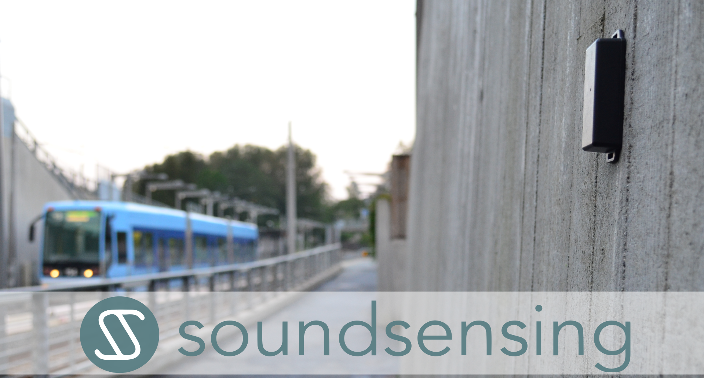
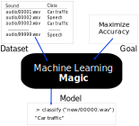
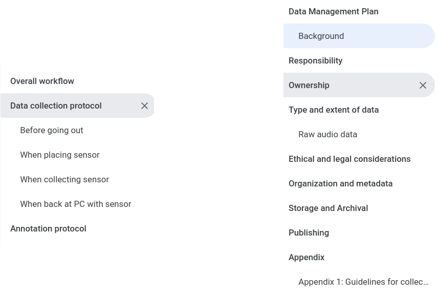
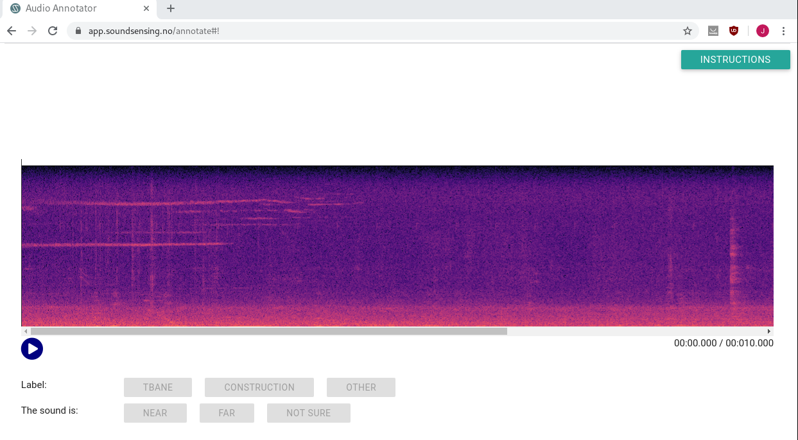
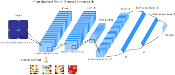
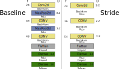
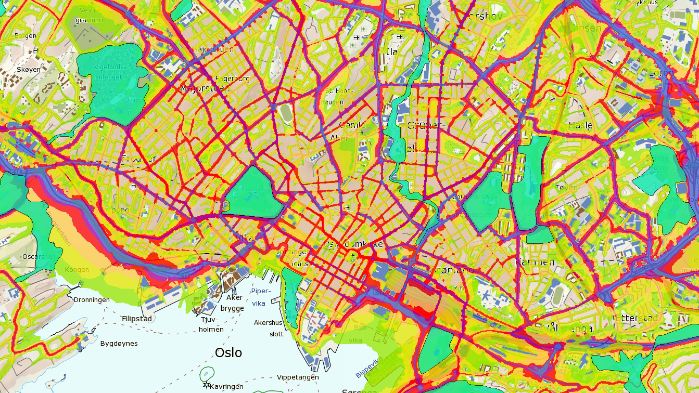
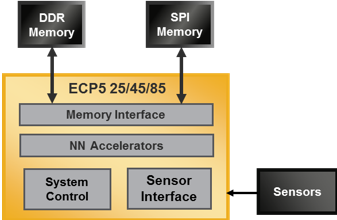

---
title: Classifying sound using Machine Learning
author: Jon Nordby <jon@soundsensing.no>
date: February 27, 2020
css: style.css
width: 1920
height: 1080
margin: 0
pagetitle: 'Artificial Summit, Knowit, Oslo: Classifying sound using Machine Learning'
---

# Introduction

## Jon Nordby

Internet of Things specialist

- B.Eng in **Electronics**
- 10 years as **Software** developer. **Embedded** + **Web**
- M. Sc in **Data** Science

Now:

- CTO at Soundsensing

## Thesis

> Environmental Sound Classification
> on Microcontrollers
> using Convolutional Neural Networks

{width=30%}

## Soundsensing

{width=100%}

::: notes
Provide **Noise Monitoring** and Audio **Condition Monitoring** solutions
that are used in Real-Estate, Industry, and Smart Cities.

Perform Machine Learning for sound classification **on sensor**.
:::

## Dashboard

## Goal

The goals of this talk

> you as Developers, understand:
>
> possibilities and applications of Audio ML
> 
> overall workflow of creating an Audio Classification solution
> 
> what Soundsensing provides in this area

# Background

## Why Audio Classification

- Rich source of information
- Any physical motion creates sound
- Sound spreads in a space
- Enables *non invasive sensing*
- Great compliment to image/video
- Humans use our hearing usefully in many tasks
- Machines can now reach similar performance

## Applications

Audio sub-fields

- Speech Recognition. Keyword spotting.
- Music Analysis. Genre classification.
- **General** / other

Examples

* Eco-acoustics. Analyze bird migrations
* Wildlife preservation. Detect poachers in protected areas
* Manufacturing Quality Control. Testing electric car seat motors
* Security: Highlighting CCTV feeds with verbal agression
* Medical. Detect heart murmurs
* Process industry. Advance process once audible event happens (popcorn)

<!--

## Outline

TODO: is it needed?

- 
- Digital sound. A primer
- Audio Classification basics
- Tips & Tricks
- Pointers to more information
-->

<!--
FIXME: explain briefly Digital Sound
-->

# Making an Audio ML solution

## Overall process

1. Problem definition
2. Data collection
3. Data labeling
4. Training setup
5. Feature representation
6. Model
7. Evaluation
8. Deployment

## Example task

Noise Classification in Urban environments. AKA *"Environmental Sound Classification"*

> Given an audio signal of environmental sounds,
> 
> determine which class it belongs to

* Widely researched. 1000 hits on Google Scholar
* Open Datasets. Urbansound8k (10 classes), ESC-50, AudioSet (632 classes)
* 2017: Human-level performance on ESC-50

::: notes

https://github.com/karoldvl/ESC-50

:::

## Supervised Learning

{width=70%}

::: notes

Supervised learning: using (large amounts of) **labeled data**, for training.
Optimizes a particular **metric**. Estimated on a parts of the dataset.

In principle, needs no more guidance.
In practice, we need to peek inside the black box.

AutoML. Field of creating that magical black-box.

:::

## Learning process

{width=80%}

::: notes

Inputs.

- Labeled dataset. Many audio samples, each **already labeled** (by humans) with the associated class
- Model architecture. An untrained model for recognizing sounds (more generally). 
- Goal specification. The metric we want to optimize for. Ex: average accuracy

Outputs:

- A **trained model**. That can classify Environmental Sounds with high accuracy.
Hopefully also sounds similar to, but not from the Urbansound8k dataset.
- Results. Metrics, plots of how well the model did. 

How to get dataset?
See if there are publically available dataset.
General rule. 1k samples per class.
But, tricks exist for cases where there is less data available.
"Low resource" datasets.

What kind of model architecture to use?
Find the most similar usecase to yours.
Start simple!

How to specify goal?
Analyze your business/usecase.
What aspect of model performance are critical.
What kind of errors are more acceptable?

:::

## Audio Classification

> Given an audio clip
> 
> with some sounds
> 
> determine which *class* it is

Classification simplifications

- Single output. One class at a time
- Discrete. Exists or not
- Closed set. Must be known class

::: notes

Classification.
Each input is mapped to a single discrete output.
Only a single class sound per audio clip.

Alt: multi-label "tagging"

Closed-set.
Sound has to be one of the N defined classes. 
Cannot handle out-of-domain inputs.

Alt: open-set

Ok, so how do we realize such a system?

:::

<!--
Other Audio ML tasks

## Audio Event Detection

> Return: time something occurred.

* Ex: "Bird singing started", "Bird singing stopped"
* Classification-as-detection. Classifier on short time-frames
* Monophonic: Returns most prominent event

Aka: Onset detection

::: notes

- Avoid time-shift augmentation

:::

## Anomaly Detection

TODO: define AD task

-->

## Data collection

Key challenges

* Ensuring representativeness
* Ensuring coverage
* Maintaining structure
* Capturing relevant metadata
* Maintaining privacy

::: notes

`FIXME: image of our Data document`

Personally identifyable information. GDPR
Sensitive data
Privacy

:::

## Data management

{width=80%}

Best practice: Design the process, document in a **protocol**

## Data Requirements

Depends on problem difficulty

* Number of classes
* Variation inside class
* Distance between classes
* Other sounds, outside classes

Targets

* Must: >100 labeled instances per class
* Want: >1000 labeled instances per class

Urbansound8k: 10 classes, 11 hours of **annotated** audio

::: notes

Roest is `<1` hour of audio.
Binary classification
Clear separation between class1 and class0
Quite little variation in the classes
Controlled environment

:::

## Data labeling

Challenge: Keeping quality high, and costs low

- What is the *human level performance*?
- Annotator *self-agreement*
- Inter-annotator *agreement*

How to label

- Outsource. Data labeling services, Mechanical Turk, ..
- Crowdsource. From the public. From your users?
- Inhouse. Dedicated resource? Part of DS team?
- Automated. Other datasources? Existing models?

::: notes

Make sure at least validation and testsets are good
Run chesks. Estimate quality 

Expertice required? Domain knowledge?

:::

## Annotation tools

{width=80%}

::: notes
`FIXME: image of our tool`

Audacity
Audio Annotator
...

:::

## Curated dataset 

{width=80%}

::: notes
`FIXME: image of our tool`
:::

<!--

## Training setup

::: notes

For each annotated section
Get the audio
Compute features on it
Mark it with the label

Pretty standard supervised ML setup
As in image classification etc

:::

-->

## Pipeline

{max-height=100%}

::: notes
TODO: 

:::

<!--
FIXME: explain briefly Convolutional Neural Network
-->

## Convolutional Neural Network

{width=70%}

## Model

<!--
Based on SB-CNN (Salamon+Bello, 2016)
-->

{width=70%}

::: notes

Baseline from SB-CNN

Few modifications

* Uses smaller input feature representation
* Reduced downsample factor to accommodate

CONV = entry point for trying different convolution operators

:::

<!--
## Evaluation

Performance metrics

-->

# Summary

## Standard models exist

Try the standard audio pipeline, it often does OK.

- Fixed-length analysis windows
- Use log-mel spectrograms as features
- Convolutional Neural Network as classifier
- Aggregate prediction from each window

All available as open source solutions.

## Data collection is not magic 

- Structure collection upfront
- Budget resources for collection and labeling
- Integrate quality checking
- Build it up gradually

Doable, but takes time!

## Now what

So have a model that performs Audio Classification **on our PC**.

But we want to monitor a real-world phenomenon.

How to deploy this?

# Deploying

## Architectures

{width=70%}

<!--
FIXME: 
-->

## Soundsensing Platform

## Demo video

<iframe src="https://www.youtube.com/embed/KQHQxMG1CZo" controls width="1000" height="700"/></iframe>

::: notes

Recognizing Urban sounds

Environmental Sound Classification

:::

## Noise Monitoring solution

# Outro

## Partner opportunities

We are building a partner network

- Partner role: Deliver solutions and integration on platform
- Especially cases that require a lot of custom work

Email: <jon@soundsensing.no>

## Employment opportunities

Think that this sounds cool to work on?

- Internships in Data Science now
- Hiring 2 developers in 2020

Email: <jon@soundsensing.no>

## Investment opportunities

Want to invest in a Machine Learning and Internet of Things startup?

- Funding round open now 
- 60% comitted
- Some open slots still

Email: <ole@soundsensing.no>

## More resources

Machine Hearing. ML on Audio

- [github.com/jonnor/machinehearing](https://github.com/jonnor/machinehearing)

Machine Learning for Embedded / IoT

- [github.com/jonnor/embeddedml](https://github.com/jonnor/embeddedml)

Thesis Report & Code

- [github.com/jonnor/ESC-CNN-microcontroller](https://github.com/jonnor/ESC-CNN-microcontroller)

Soundsensing

- [soundsensing.no](https://soundsensing.no)

## Questions

<h1 style="padding: 100px">?</h1>

Email: <jon@soundsensing.no>

# BONUS

# Thesis results

## Model comparison

{width=100%}

::: notes

- Baseline relative to SB-CNN and LD-CNN is down from 79% to 73%
Expected because poorer input representation.
Much lower overlap 

:::

## List of results

{width=100%}

## Confusion

{width=70%}

## Grouped classification

{width=60%}

Foreground-only

## Unknown class

{width=100%}

::: notes

Idea: If confidence of model is low, consider it as "unknown"

* Left: Histogram of correct/incorrect predictions
* Right: Precision/recall curves
* Precision improves at expense of recall
* 90%+ precision possible at 40% recall

Usefulness:

* Avoids making decisions on poor grounds
* "Unknown" samples good candidates for labeling->dataset. Active Learning 
* Low recall not a problem? Data is abundant, 15 samples a 4 seconds per minute per sensor

:::

# Background

## Mel-spectrogram

## Noise Pollution

Reduces health due to stress and loss of sleep

In Norway

* 1.9 million affected by road noise (2014, SSB)
* 10'000 healty years lost per year (Folkehelseinstituttet)

In Europe

* 13 million suffering from sleep disturbance (EEA)
* 900'000 DALY lost (WHO)

::: notes

1.9 million
https://www.ssb.no/natur-og-miljo/artikler-og-publikasjoner/flere-nordmenn-utsatt-for-stoy

1999: 1.2 million 

10 245 tapte friske leveår i Norge hvert år
https://www.miljostatus.no/tema/stoy/stoy-og-helse/

https://www.eea.europa.eu/themes/human/noise/noise-2

Burden of Disease WHO
http://www.euro.who.int/__data/assets/pdf_file/0008/136466/e94888.pdf

:::

## Noise Mapping

Simulation only, no direct measurements

::: notes

- Known sources
- Yearly average value
- Updated every 5 years
- Low data quality. Ex: communal roads

Image: https://www.regjeringen.no/no/tema/plan-bygg-og-eiendom/plan--og-bygningsloven/plan/kunnskapsgrunnlaget-i-planlegging/statistikk-i-plan/id2396747/

:::

# Audio Machine Learning on low-power sensors 

## Wireless Sensor Networks

- Want: Wide and dense coverage
- Need: Sensors need to be low-cost
- **Opportunity**: Wireless reduces costs
- **Challenge**: Power consumption

::: notes

* No network cabling, no power cabling
* No site infrastructure needed
* Less invasive
* Fewer approvals needed
* Temporary installs feasible
* Mobile sensors possible

Electrician is 750 NOK/hour

Image: https://www.nti-audio.com/en/applications/noise-measurement/unattended-monitoring
:::

## What do you mean by low-power?

Want: 1 year lifetime for palm-sized battery

Need: `<1mW` system power

## General purpose microcontroller

{width=40%}

STM32L4 @ 80 MHz. Approx **10 mW**.

- TensorFlow Lite for Microcontrollers (Google)
- ST X-CUBE-AI (ST Microelectronics)

## FPGA

{width=50%}

Human presence detection. VGG8 on 64x64 RGB image, 5 FPS: 7 mW.

Audio ML approx **1 mW**

## Neural Network co-processors

{width=25%}

2.9 TOPS/W. AlexNet, 1000 classes, 10 FPS. 41 mWatt

Audio models probably **< 1 mWatt**. 

::: notes

https://www.latticesemi.com/Blog/2019/05/17/18/25/sensAI

:::

## Urbansound8k 

{width=100%}

::: notes 

Classes from an urban sound taxonomy,
based on noise complains in New York city

Most sounds around 4 seconds. Some classes around 1 second

Foreground/background

:::

## Environmental Sound Classification on edge

## Existing work

- Convolutional Neural Networks dominate
- Techniques come from image classification
- Mel-spectrogram input standard
- End2end models: getting close in accuracy
- "Edge ML" focused on mobile-phone class HW
- "Tiny ML" (sensors) just starting

::: notes

* Efficient Keyword-Spotting
* Efficient (image) CNNs
* Efficient ESC-CNN

ESC-CNN

* 23 papers reviewed in detail
* 10 referenced in thesis
* Only 4 consider computational efficiency

:::

## Model requirements

With 50% of STM32L476 capacity:

* 64 kB RAM
* 512 kB FLASH memory
* 4.5 M MACC/second

::: notes

* RAM: 1000x 64 MB
* PROGMEM: 1000x 512 MB
* CPU: 1000x 5 GFLOPS
* GPU: 1000'000X 5 TFLOPS

:::

## Existing models

{width=100%}

eGRU: running on ARM Cortex-M0 microcontroller, accuracy 61% with **non-standard** evaluation

::: notes

Assuming no overlap. Most models use very high overlap, 100X higher compute

:::

# Research Topics

## Waveform input to model

- Preprocessing. Mel-spectrogram: **60** milliseconds
- CNN. Stride-DS-24: **81** milliseconds
- With quantization, spectrogram conversion is the bottleneck!
- Convolutions can be used to learn a Time-Frequency transformation.

Can this be faster than the standard FFT? And still perform well?

::: notes

- Especially interesting with CNN hardware acceleration.

:::

## On-sensor inference challenges

- Reducing power consumption. Adaptive sampling
- Efficient training data collection in WSN. Active Learning?
- Real-life performance evaluations. Out-of-domain samples

::: notes

TODO: Add few more projects here. From research document

:::

# Shrinking a Convolutional Neural Network

## Reduce input dimensionality

{width=70%}

- Lower frequency range
- Lower frequency resolution
- Lower time duration in window
- Lower time resolution

::: notes

Directly limits time and RAM use first few layers.

Follow-on effects.
A simpler input representation is (hopefully) easier to learn
allowing for a simpler model

TODO: make a picture illustrating this

:::

## Reduce overlap

{width=80%}

Models in literature use 95% overlap or more. 20x penalty in inference time!

Often low performance benefit. Use 0% (1x) or 50% (2x).

<!--
## Regular 2D-convolution

{width=100%}

::: notes

TODO: illustrate the cubical nature. Many channel

:::
-->

## Depthwise-separable Convolution

{width=90%}

MobileNet, "Hello Edge", AclNet. 3x3 kernel,64 filters: 7.5x speedup
 
::: notes

* Much fewer operations
* Less expressive - but regularization effect can be beneficial

:::

## Spatially-separable Convolution

{width=90%}

EffNet, LD-CNN. 5x5 kernel: 2.5x speedup

## Downsampling using max-pooling

{width=100%}

Wasteful? Computing convolutions, then throwing away 3/4 of results!

## Downsampling using strided convolution

{width=100%}

Striding means fewer computations and "learned" downsampling

## Model comparison

{width=100%}

::: notes

- Baseline relative to SB-CNN and LD-CNN is down from 79% to 73%
Expected because poorer input representation.
Much lower overlap 

:::

## Performance vs compute

{width=100%}

::: notes

- Performance of Strided-DS-24 similar to Baseline despite 12x the CPU use
- Suprising? Stride alone worse than Strided-DS-24
- Bottleneck and EffNet performed poorly
- Practical speedup not linear with MACC

:::

<!--

-->

## Quantization

Inference can often use 8 bit integers instead of 32 bit floats

- 1/4 the size for weights (FLASH) and activations (RAM) 
- 8bit **SIMD** on ARM Cortex M4F: 1/4 the inference time
- Supported in X-CUBE-AI 4.x (July 2019)

<!--

## Stronger training process 

- Data Augmentation. *Mixup*, *SpecAugment*
- Transfer Learning on more data. *AudioSet*

-->

::: notes

EnvNet-v2 got 78.3% on Urbansound8k with 16 kHz
:::

