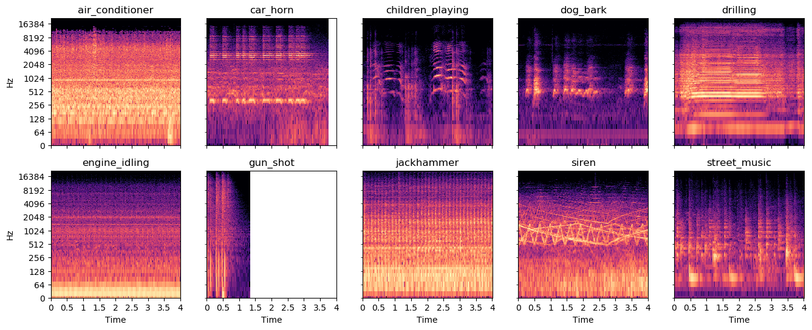
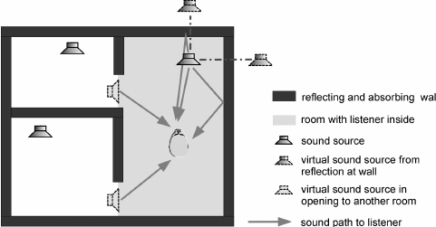
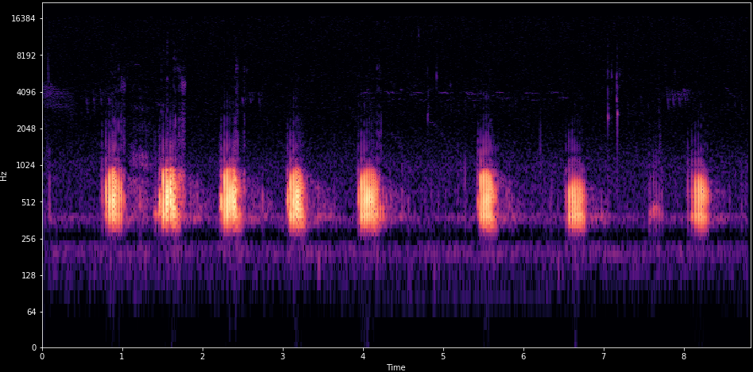
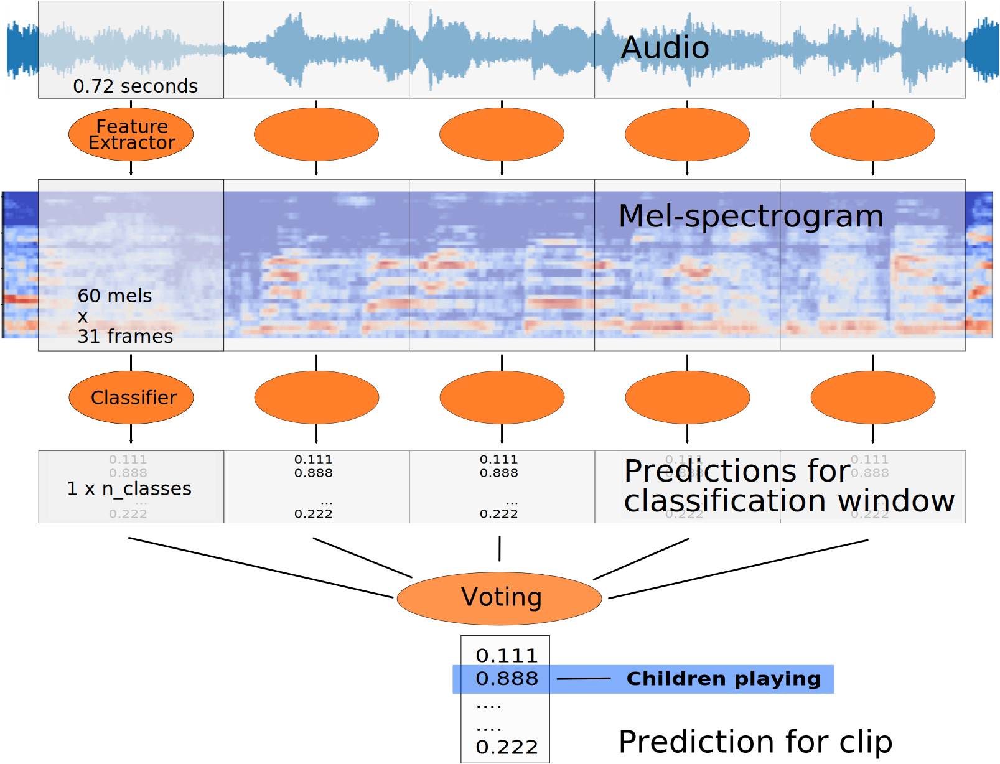
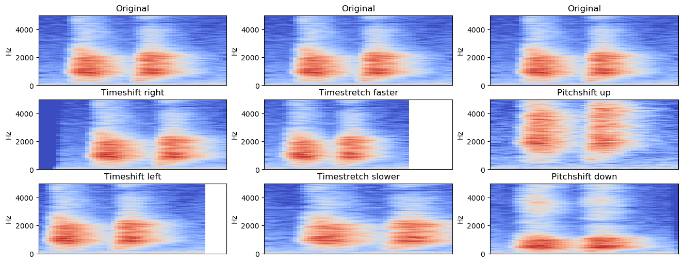
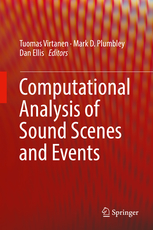
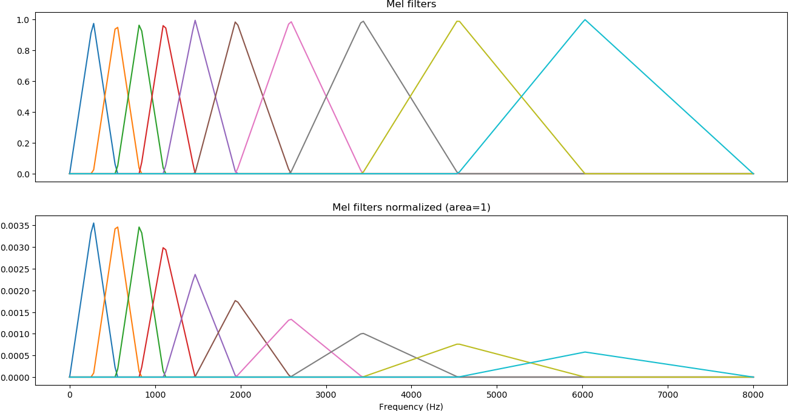

---
author: Jon Nordby @jononor
date: PyCode 2019, Gdansk
title: Recognizing sounds with Machine Learning and Python
width: 1280
height: 960
margin: 0
css: style.css
---

# Introduction

## Jon Nordby

Internet of Things specialist

- B.Eng in **Electronics** (2010)
- 9 years as **Software** developer. **Embedded** + **Web**
- M.Sc in **Data** Science (2019)

Today

- Consulting on IoT + Machine Learning
- CTO @ Soundsensing.no

## Soundsensing.no

Provide **Noise Monitoring** and **Condition Monitoring** solutions
that are used in Real-Estate, Industry, and Smart Cities.

`TODO: picture of Soundsensing.no sensor unit`

Perform Machine Learning for sound classification **on sensor**.

## This talk

Goal

> a Python programmer
> 
> without expertice in sound processing
> and limited machine learning experience
> 
> can solve basic Audio Classification problems

## Outline

- An example task
- Digital sound primer
- Audio Classification basics
- Tips & Tricks
- Pointers to more information

Slides and more: [https://github.com/jonnor/machinehearing](https://github.com/jonnor/machinehearing)

::: notes
Very practically oriented.

Will try to define the neccesary Machine Learning concepts as we go along
:::


# Practical task

## Recognizing Urban sounds

`TODO: audio example of inputs`

::: notes

Environmental Sound Classification

:::

## System specification

> Given an audio signal of environmental sounds,
> 
> determine which class it belongs to


`TODO: image of overall system`

::: notes

Classification.
Each input is mapped to a single discrete output.
Only a single class sound per audio clip.

Closed-set.
Sound has to be one of the N defined classes. 
Cannot handle out-of-domain inputs.

Ok, so how do we realize such a system?

:::

## Supervised Machine Learning


`TODO: image of inputs,outputs`

::: notes

*Supervised* Machine Learning process:

Supervised learning: using (large amounts of) labeled data, for training.

Inputs.

- Labeled dataset. Many audio samples, each **already labeled** (by humans) with the associated class
- Model architecture. An untrained model for recognizing sounds (more generally). 
- Goal specification. The metric we want to optimize for. Ex: average accuracy

Outputs:

- A **trained model**. That can classify Environmental Sounds with high accuracy.
Hopefully also sounds similar to, but not from the Urbansound8k dataset.
- Results. Metrics, plots of how well the model did. 

How to get dataset?
See if there are publically available dataset.
General rule. 1k samples per class.
But, tricks exist for cases where there is less data available.
"Low resource" datasets.

What kind of model architecture to use?
Find the most similar usecase to yours.
Start simple!

How to specify goal?
Analyze your business/usecase.
What aspect of model performance are critical.
What kind of errors are more acceptable?

::: 


## Urbansound8k 

{width=80%}

State-of-the-art accuracy: 79% - 82%

::: notes 

- Classes from an urban sound taxonomy,
- Based on noise complains in New York City
- Most sounds around 4 seconds.
- Some classes around 1 second
- Saliency annotated  (foreground/background)

:::


# Digital sound primer

## Audio Mixtures

{width=80%}

::: notes

https://www.researchgate.net/profile/Raimund_Dachselt/publication/228715257/figure/fig1/AS:301960805797899@1449004474993/Reverberant-rooms-with-walls-and-openings-For-overlapping-areas-a-parameter-called.png

Channel effects

- Noise
- Frequency response
- Reverberation

:::

<!--

## Human hearing

Two ears (Binaural). Frequencies approx 20Hz - 20kHz. 

A non-linear system

* Loudness is not linear with sound pressure
* Loudness is frequency dependent 
* Compression. Sensitivity lowered when loud
* Masking. Close sounds can hide eachother

::: notes
:::
-->

## Audio acquisition

{width=80%}

## Digital sound representation

* Quantized in time (ex: 44100 Hz)
* Quantizied in amplitude (ex: 16 bit)
* N channels. **Mono**/Stereo
* Uncompressed formats: PCM **.WAV**
* Lossless compression: .FLAC
* Lossy compression: .MP3

## Spectrogram

Computed using Short-Time-Fourier-Transform (STFT)

{width=60%}


# Basic Audio Classification pipeline

## Pipeline

{width=70%}

::: notes


## Choices

**Window size**. How big in time?

Spectrogram preprocessing. Try Mel-filtered, log-scaled and standardized first. 40-128 bands.

- 

::: notes

Window size (in time). Decides how much the model "sees" at a time.

Longer when phenomenon of interest is longer.
Shorter if needing predictions more often (event detection).
Shorter window is beneficial. Smaller input, smaller model. 
Easier to train, lower inference time, lower storage/RAM requirements.

+ pretrained image models often want rectangular inputs. Ex: 128x128


Mel-spectrogram.
First try what everyone else uses.
Look at the spectrograms.
Check that *you* can see the phenomenon in question!
And see differences between spectrograms of different classes.

- Mel-filters. 40-128
- log-scale compression
- Standardize. Subtract mean, divide by std

Per recording or per analysis window
Global clip/dataset analysis for normalization not possible when streaming


:::

## Feature preprocessing


```python
def load_audio_windows(path, ...):

    y, sr = librosa.load(path, sr=samplerate)
    S = librosa.core.stft(y, n_fft=n_fft,
                            hop_length=hop_length, win_length=win_length)
    mels = librosa.feature.melspectrogram(y=y, sr=sr, S=S,
                                            n_mels=n_mels, fmin=fmin, fmax=fmax)

    # Truncate at end to only have windows full data. Alternative: zero-pad
    start_frame = window_size
    end_frame = window_hop * math.floor(float(frames.shape[1]) / window_hop)
    windows = []
    for frame_idx in range(start_frame, end_frame, window_hop):

        window = mels[:, frame_idx-window_size:frame_idx]

        mels = numpy.log(window + 1e-9)
        mels -= numpy.mean(mels)
        mels /= numpy.std(mels)

        assert mels.shape == (n_mels, window_size)
        windows.append(mels)

    return windows
```


## Convolutional Neural Network

1: Spectrograms are *image-like* 

2: CNNs are best-in-class for image-classification

=> Will CNNs work well on spectrograms?

<p class="fragment fade-in" style='padding-top: 30px'>Yes!</p>

<p class="fragment fade-in" style='padding-top: 30px'>A bit suprising?</p>

::: notes

Suprising?

- Spectrogram axes not equivalent to eachother.
One is frequency, other is time.
Shifting does not mean the same in each axis.
- No direct ability to model larger frequency patterns (overtones, formants)
- Longer-term time information is lost
- Convolutional Recurrent Neural Networks (CRNN)

Benefits:

- Practices from image classification apply!
Much bigger field.

:::

## SB-CNN

{height=80%,max-width=100%}


::: notes

- 40 mels
- 61 frames

:::

## Keras model

```python
from keras.layers import ...

def build_model(...):

    block1 = [
        Convolution2D(filters, kernel, padding='same', strides=strides,
                      input_shape=(bands, frames, channels)),
        MaxPooling2D(pool_size=pool),
        Activation('relu'),
    ]
    block2 = [
        Convolution2D(filters*kernels_growth, kernel, padding='same', strides=strides),
        MaxPooling2D(pool_size=pool),
        Activation('relu'),
    ]
    block3 = [
        Convolution2D(filters*kernels_growth, kernel, padding='valid', strides=strides),
        Activation('relu'),
    ]
    backend = [
        Flatten(),

        Dropout(dropout),
        Dense(fully_connected, kernel_regularizer=l2(0.001)),
        Activation('relu'),

        Dropout(dropout),
        Dense(num_labels, kernel_regularizer=l2(0.001)),
        Activation('softmax'),
    ]
    layers = block1 + block2 + block3 + backend
    model = Sequential(layers)
    return model
```

## Aggregating analysis windows

```python
from keras import Model
from keras.layers import Input, TimeDistributed, GlobalAveragePooling1D

def build_multi_instance(base, windows=6, bands=32, frames=72, channels=1):

    input = Input(shape=(windows, bands, frames, channels))

    x = input
    x = TimeDistributed(base)(x)
    x = GlobalAveragePooling1D()(x)
    model = Model(input,x)
    return model
```

*GlobalAveragePooling* -> "Probabilistic voting"

::: notes 

* Max pooling
* Majority vote
* Trained classifier

:::


# Demo

## Demo video

<iframe src="https://www.youtube.com/embed/KQHQxMG1CZo" controls width="1500" height="1000"/></iframe>

## Environmental Sound Classification on Microcontrollers using Convolutional Neural Networks

{height=600px}


# Tips and Tricks


## Data Augmentation

{width=100%}

* Adding noise. Random/sampled
* `Mixup`. Mixing two samples, adjusting class labels 
* `SpecAugment`. Mask spectrogram sections to augment

::: notes

Synthesizing samples to increase size of dataset.
Adding variations (that may occur in real-life), without changing the label.

Mostly done in time-domain,
but can also be done in spectrograms

{width=60%}

{width=60%}

Xu2018:
https://arxiv.org/abs/1805.07319

https://neurohive.io/en/news/specaugment-new-and-simple-data-augmentation-technique-for-audio-data/
:::


## Transfer Learning from images

Transfer Learning from image data works!

=> Can use models pretrained on ImageNet

Caveats:

- If RGB input, should fill all 3 channels
- Usually need to fine tune the model. Some or all layers

::: notes

`TODO: image explaining Transfer Learning` 

`TODO: code example using Keras Applications MobileNet ?`

```

from keras.applications.inception_v3 import InceptionV3

base_model = InceptionV3(weights='imagenet', include_top=False)

# add a global spatial average pooling layer
x = base_model.output
x = GlobalAveragePooling2D()(x)
# let's add a fully-connected layer
x = Dense(1024, activation='relu')(x)
# and a logistic layer -- let's say we have 200 classes
predictions = Dense(200, activation='softmax')(x)

```
:::


## Audio Embeddings

- Model pretrained for sound, feature-extracting only
- Example. Look, Listen, Learn ({L^3}). 1 second, 512-d vector
- Accessible as Python package `OpenL3`
- Only need to add a simple classifier on this
- Uses a CNN under the hood


::: notes

```
import openl3


```

`FIXME: finish code example using OpenL3 ?`

Only need to add a simple classifier!
Linear. Random Forest.

Can OpenL3 be used with real-time streaming?
https://github.com/marl/openl3/issues/36

Other embedding models:

EdgeL3
SoundNet

:::

# Your own Audio task


## Annotating audio

{width=100%}

```python
import pandas

labels = pandas.read_csv(path, sep='\t', header=None,
                        names=['start', 'end', 'annotation'],
                        dtype=dict(start=float,end=float,annotation=str))
```

::: notes

- Use Audacity
- Label track
- Keyboard shortcuts to add
- Annotation file is a basic CSV
- Tools. Editing. Spectrogram view. Noise removal

:::


# Outro

## Summary

Try the standard audio pipeline shown!

- Fixed-length analysis windows
- Use log-mel spectrograms as features
- Convolutional Neural Network as model
- Aggregate prediction from each window

Start simple!

1. Audio Embeddings (OpenL3) + simple model (scikit-learn)
2. Convolutional Neural Networks with Transfer Learning (ImageNet etc)
3. ... train **simple** CNN from scratch ... 

Use Data Augmentation!

1. Time-shift
2. Time-stretch, pitch-shift, noise-add
3. Mixup, SpecAugment

::: notes

`FIXME: style sensibly`

:::

## More learning

Slides and more: [https://github.com/jonnor/machinehearing](https://github.com/jonnor/machinehearing)

Hands-on: [TensorFlow tutorial, Simple Audio Recognition](https://www.tensorflow.org/tutorials/sequences/audio_recognition)

Book: Computational Analysis of Sound Scenes and Events (Virtanen/Plumbley/Ellis, 2018) 

<!--
{width=20%}
-->

## Questions

Slides and more: [https://github.com/jonnor/machinehearing](https://github.com/jonnor/machinehearing)

<h1 style="padding: 100px">?</h1>

Interested in Audio Classification or Machine Hearing generally? Get in touch!

Twitter: @[jononor](https://twitter.com/jononor)

Email: `jon@soundsensing.no`


# BONUS

# More advanced problem formulations

## Audio Event Detection

> Return: time something occurred.

* Ex: "Bird singing started", "Bird singing stopped"
* Classification-as-detection. Classifier on short time-frames
* Monophonic: Returns most prominent event

Aka: Onset detection

::: notes

- Avoid time-shift augmentation

:::

## Segmentation

> Return: sections of audio containing desired class

* Postprocesing on Event Detection time-stamps
* Pre-processing to specialized classifiers


::: notes

Eg: Extract only birdcall audio, then perform bird species identification

- Can alternatively be done unsupervised
- Can be real-time / single-pass, or multi-pass

:::

## Tagging

> Return: All classes/events that occurred in audio.

Approaches

* separate classifiers per 'track'
* joint model: multi-label classifier


##

# Details

## Analysis windows

{width=80%}

::: notes

Image:
https://www.researchgate.net/figure/Framing-the-input-audio-signal-into-several-frames-s-s-1-with-appropriate_fig1_332553888

@misc{Sajjad2019,
  author = {Abdoli, Sajjad and Cardinal, Patrick and Koerich, Alessandro},
  year = {2019},
  month = {04},
  pages = {},
  title = {End-to-End Environmental Sound Classification using a 1D Convolutional Neural Network}
}


Hyperparameters:

- Window length
- Window hop / overlap

Depends primarily on how often you want predictions
but beneficial to limit window size:

- lower input dimensionality, easier to learn
- smaller model size
- lower inference time
- lower RAM consumption

+ pretrained image models often want rectangular inputs.
Ex: 128x128

if using a short window compared to label/prediction time,
need to aggregate the predictions somehow

if we want output on a shorter time-basis than labels are available for,
we have a 'weak labeling' scenario

:::


## Mel-filters

{width=80%}

::: notes

Hyperparameters:

- Samplerate
(44.1/48kHz originals. 22kHz commonly used, 16 kHz sometimes)
- Mel filters
- Hop length
- Filter frequency range

(window function: Hann, overlap 50%)

In Python:

- librosa.feature.melspectrogram()
CPU only. Numpy
- Kapre Melspectrogram layer.
GPU. Using Tensorflow STFT operation

:::

## Spectrogram normalization

- log-scale compression
- Subtract mean
- Standard scale

{width=60%}

::: notes


:::


## Streaming

Real-time classification

- Global clip/dataset analysis for normalization not possible

::: notes

`TODO: document how to do in Python`

:::


<!--

## Creating datasets

::: notes

Use lossless compression
Make sure autogain is off (smartphones)

Make a plan for how to record

Capture information about recording setup.
Recording equipment. Recording settings.
System under test.
Environmental conditions.
Take pictures.
Keep a written log of things that happen during recording.
Timestamp important events.

:::

-->


## Mel-Frequency Cepstral Coefficients (MFCC)

* MFCC = DCT(mel-spectrogram)
* Popular in Speech Detection
* Compresses: 13-20 coefficients
* Decorrelates: Beneficial with linear models 

On general audio, with strong classifier, performs worse than log mel-spectrogram

## End2End learning

Using the raw audio input as features with Deep Neural Networks.

Need to learn also the time-frequency decomposition,
normally performed by the spectrogram. 

Actively researched using advanced models and large datasets.

`TODO: link EnvNet`

## Sequence models

Convolutional Recurrent Neural Networks


# Bla bla

## Why Audio Classification

- Rich source of information
- Any physical motion creates sound
- Sound 
- Good compliment to image/video
- Humans use our hearing


## Applications

Audio sub-fields

- Speech Recognition. Keyword spotting.
- Music Analysis. Genre classification.
- **General** / other

Examples

* Eco-acoustics. Analyze bird migrations
* Wildlife preservation. Detect poachers in protected areas
* Manufacturing Quality Control. Testing electric car seat motors
* Security: Highlighting CCTV feeds with verbal agression
* Medical. Detect heart murmurs
* Process industry. Advance process once audible event happens (popcorn)


